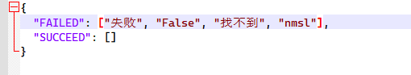

# ScriptComposeClient

My GUI client for Script-Compose, is an alternative log viewer and analyzer that provides a better experience than the origin web viewer.

## Screenshots

## How to use

1. Download a release from github releases.

2. Unzip the .zip file, modify the **keyword.json** in cfg folder to add keywords for analyzer. Modify the **services.yaml** to add ScriptCompose ([GitHub - Hochikong/ScriptsCompose: Simple scripts compose and executor](https://github.com/Hochikong/ScriptsCompose)) service connection params.

3. Double click the **ScriptComposeClient.exe** to launch the program.

4. Double click the **MainCompose** on the left to connect to the ScriptCompose service.
   
   
   
   

5. Select a time range from bottom to filter logs.
   
   

6. How to check task info
   
   
   
   

7. How to fetch log briefs and view log details
   
   
   
   
   
   

8. How to analyze logs by keywords
   
   First you should configure keywords:
   
   
   
   
   
   
   
   Due to a keyword found, that row mark with red color.
   
   

